# 🔄 CI/CD Pipeline - Fox Framework v1.0.0

## 🎯 Descripción General

Este documento describe la configuración de pipelines de CI/CD para automatizar el proceso de testing, building y deployment de Fox Framework.

## 🏗️ Arquitectura del Pipeline



```mermaid
graph LR
    A[Code Push] --> B[CI Trigger]
    B --> C[Unit Tests]
    C --> D[Integration Tests]
    D --> E[Build]
    E --> F[Security Scan]
    F --> G[Deploy to Staging]
    G --> H[Staging Tests]
    H --> I[Manual Approval]
    I --> J[Deploy to Production]
    J --> K[Health Checks]
    K --> L[Monitoring]
```

## 🚀 GitHub Actions Configuration

### Main Workflow (.github/workflows/ci-cd.yml)

```yaml
name: Fox Framework CI/CD

on:
  push:
    branches: [ main, develop ]
  pull_request:
    branches: [ main ]
  release:
    types: [ published ]

env:
  NODE_VERSION: '18'
  REGISTRY: ghcr.io
  IMAGE_NAME: ${{ github.repository }}

jobs:
  test:
    runs-on: ubuntu-latest
    name: 🧪 Test Suite
    
    steps:
    - name: 📥 Checkout code
      uses: actions/checkout@v4
      
    - name: 🟢 Setup Node.js
      uses: actions/setup-node@v4
      with:
        node-version: ${{ env.NODE_VERSION }}
        cache: 'npm'
        
    - name: 📦 Install dependencies
      run: npm ci
      
    - name: 🔍 Lint code
      run: npm run lint
      
    - name: 🧪 Run unit tests
      run: npm run test:unit
      
    - name: 🔗 Run integration tests
      run: npm run test:integration
      
    - name: 📊 Generate coverage report
      run: npm run test:coverage
      
    - name: 📈 Upload coverage to Codecov
      uses: codecov/codecov-action@v3
      with:
        file: ./coverage/lcov.info
        flags: unittests
        name: codecov-umbrella

  security:
    runs-on: ubuntu-latest
    name: 🔐 Security Scan
    needs: test
    
    steps:
    - name: 📥 Checkout code
      uses: actions/checkout@v4
      
    - name: 🛡️ Run npm audit
      run: npm audit --audit-level moderate
      
    - name: 🔍 Run Snyk security scan
      uses: snyk/actions/node@master
      env:
        SNYK_TOKEN: ${{ secrets.SNYK_TOKEN }}
      with:
        args: --severity-threshold=high

  build:
    runs-on: ubuntu-latest
    name: 🏗️ Build & Package
    needs: [test, security]
    
    steps:
    - name: 📥 Checkout code
      uses: actions/checkout@v4
      
    - name: 🟢 Setup Node.js
      uses: actions/setup-node@v4
      with:
        node-version: ${{ env.NODE_VERSION }}
        cache: 'npm'
        
    - name: 📦 Install dependencies
      run: npm ci
      
    - name: 🏗️ Build TypeScript
      run: npm run build
      
    - name: 📋 Create build artifact
      run: |
        mkdir -p build-artifacts
        cp -r dist/ build-artifacts/
        cp package*.json build-artifacts/
        cp -r docs/ build-artifacts/
        
    - name: 📤 Upload build artifacts
      uses: actions/upload-artifact@v4
      with:
        name: fox-framework-build
        path: build-artifacts/
        retention-days: 30

  docker:
    runs-on: ubuntu-latest
    name: 🐳 Docker Build & Push
    needs: build
    if: github.event_name == 'push' && github.ref == 'refs/heads/main'
    
    steps:
    - name: 📥 Checkout code
      uses: actions/checkout@v4
      
    - name: 🐳 Setup Docker Buildx
      uses: docker/setup-buildx-action@v3
      
    - name: 🔑 Login to Container Registry
      uses: docker/login-action@v3
      with:
        registry: ${{ env.REGISTRY }}
        username: ${{ github.actor }}
        password: ${{ secrets.GITHUB_TOKEN }}
        
    - name: 📋 Extract metadata
      id: meta
      uses: docker/metadata-action@v5
      with:
        images: ${{ env.REGISTRY }}/${{ env.IMAGE_NAME }}
        tags: |
          type=ref,event=branch
          type=ref,event=pr
          type=sha
          type=raw,value=latest,enable={{is_default_branch}}
          
    - name: 🏗️ Build and push Docker image
      uses: docker/build-push-action@v5
      with:
        context: .
        push: true
        tags: ${{ steps.meta.outputs.tags }}
        labels: ${{ steps.meta.outputs.labels }}
        cache-from: type=gha
        cache-to: type=gha,mode=max

  deploy-staging:
    runs-on: ubuntu-latest
    name: 🚀 Deploy to Staging
    needs: [build, docker]
    if: github.ref == 'refs/heads/develop'
    environment: staging
    
    steps:
    - name: 📥 Checkout code
      uses: actions/checkout@v4
      
    - name: 🔑 Configure AWS credentials
      uses: aws-actions/configure-aws-credentials@v4
      with:
        aws-access-key-id: ${{ secrets.AWS_ACCESS_KEY_ID }}
        aws-secret-access-key: ${{ secrets.AWS_SECRET_ACCESS_KEY }}
        aws-region: us-west-2
        
    - name: 🚀 Deploy to ECS Staging
      run: |
        aws ecs update-service \
          --cluster fox-framework-staging \
          --service fox-framework-service \
          --force-new-deployment
          
    - name: ⏳ Wait for deployment
      run: |
        aws ecs wait services-stable \
          --cluster fox-framework-staging \
          --services fox-framework-service
          
    - name: 🧪 Run staging validation
      run: |
        sleep 30  # Wait for service to be ready
        npm run staging:validate:remote

  deploy-production:
    runs-on: ubuntu-latest
    name: 🌟 Deploy to Production
    needs: deploy-staging
    if: github.event_name == 'release'
    environment: production
    
    steps:
    - name: 📥 Checkout code
      uses: actions/checkout@v4
      
    - name: 🔑 Configure AWS credentials
      uses: aws-actions/configure-aws-credentials@v4
      with:
        aws-access-key-id: ${{ secrets.AWS_ACCESS_KEY_ID }}
        aws-secret-access-key: ${{ secrets.AWS_SECRET_ACCESS_KEY }}
        aws-region: us-west-2
        
    - name: 🌟 Deploy to ECS Production
      run: |
        aws ecs update-service \
          --cluster fox-framework-production \
          --service fox-framework-service \
          --force-new-deployment
          
    - name: ⏳ Wait for deployment
      run: |
        aws ecs wait services-stable \
          --cluster fox-framework-production \
          --services fox-framework-service
          
    - name: 🔍 Production health check
      run: |
        sleep 60  # Wait for service to be ready
        curl -f ${{ secrets.PRODUCTION_URL }}/health
        
    - name: 📊 Performance baseline
      run: |
        npm run performance:baseline:production

  notify:
    runs-on: ubuntu-latest
    name: 📢 Notifications
    needs: [deploy-staging, deploy-production]
    if: always()
    
    steps:
    - name: 📢 Slack notification
      uses: 8398a7/action-slack@v3
      with:
        status: ${{ job.status }}
        channel: '#deployments'
        text: |
          Fox Framework deployment ${{ job.status }}!
          Branch: ${{ github.ref }}
          Commit: ${{ github.sha }}
      env:
        SLACK_WEBHOOK_URL: ${{ secrets.SLACK_WEBHOOK_URL }}
```

## 🔧 GitLab CI Configuration

### .gitlab-ci.yml

```yaml
stages:
  - test
  - security
  - build
  - deploy-staging
  - validate-staging
  - deploy-production

variables:
  NODE_VERSION: "18"
  DOCKER_IMAGE: "$CI_REGISTRY_IMAGE:$CI_COMMIT_SHA"

# Templates
.node-cache: &node-cache
  cache:
    key: "$CI_COMMIT_REF_SLUG"
    paths:
      - node_modules/
      - .npm/

.aws-config: &aws-config
  image: amazon/aws-cli:latest
  before_script:
    - aws configure set aws_access_key_id $AWS_ACCESS_KEY_ID
    - aws configure set aws_secret_access_key $AWS_SECRET_ACCESS_KEY
    - aws configure set region $AWS_DEFAULT_REGION

# Test Stage
test:unit:
  stage: test
  image: node:18-alpine
  <<: *node-cache
  script:
    - npm ci
    - npm run lint
    - npm run test:unit
    - npm run test:coverage
  artifacts:
    reports:
      coverage_report:
        coverage_format: cobertura
        path: coverage/cobertura-coverage.xml
    paths:
      - coverage/
    expire_in: 1 week

test:integration:
  stage: test
  image: node:18-alpine
  <<: *node-cache
  script:
    - npm ci
    - npm run test:integration
  artifacts:
    reports:
      junit: test-results.xml

# Security Stage
security:audit:
  stage: security
  image: node:18-alpine
  script:
    - npm audit --audit-level moderate
  allow_failure: true

security:snyk:
  stage: security
  image: snyk/snyk:node
  script:
    - snyk auth $SNYK_TOKEN
    - snyk test --severity-threshold=high
  allow_failure: true

# Build Stage
build:app:
  stage: build
  image: node:18-alpine
  <<: *node-cache
  script:
    - npm ci
    - npm run build
  artifacts:
    paths:
      - dist/
      - package*.json
    expire_in: 1 week

build:docker:
  stage: build
  image: docker:latest
  services:
    - docker:dind
  script:
    - docker login -u $CI_REGISTRY_USER -p $CI_REGISTRY_PASSWORD $CI_REGISTRY
    - docker build -t $DOCKER_IMAGE .
    - docker push $DOCKER_IMAGE
  only:
    - main
    - develop

# Staging Deployment
deploy:staging:
  stage: deploy-staging
  <<: *aws-config
  script:
    - |
      aws ecs update-service \
        --cluster fox-framework-staging \
        --service fox-framework-service \
        --force-new-deployment
    - |
      aws ecs wait services-stable \
        --cluster fox-framework-staging \
        --services fox-framework-service
  environment:
    name: staging
    url: https://staging.fox-framework.com
  only:
    - develop

validate:staging:
  stage: validate-staging
  image: node:18-alpine
  script:
    - sleep 30  # Wait for deployment
    - npm ci
    - npm run staging:validate:remote
  only:
    - develop

# Production Deployment
deploy:production:
  stage: deploy-production
  <<: *aws-config
  script:
    - |
      aws ecs update-service \
        --cluster fox-framework-production \
        --service fox-framework-service \
        --force-new-deployment
    - |
      aws ecs wait services-stable \
        --cluster fox-framework-production \
        --services fox-framework-service
  environment:
    name: production
    url: https://fox-framework.com
  when: manual
  only:
    - main
```

## 🔧 Scripts de Automation

### package.json Scripts

```json
{
  "scripts": {
    "test:unit": "jest --config=jest.config.ts --testPathPattern='__tests__'",
    "test:integration": "jest --config=jest.config.ts --testPathPattern='integration'",
    "test:coverage": "jest --coverage --config=jest.config.ts",
    "test:ci": "npm run test:unit && npm run test:integration",
    
    "lint": "eslint 'src/**/*.ts' 'tsfox/**/*.ts'",
    "lint:fix": "eslint 'src/**/*.ts' 'tsfox/**/*.ts' --fix",
    
    "build": "tsc -p tsconfig.json",
    "build:watch": "tsc -p tsconfig.json --watch",
    "build:clean": "rm -rf dist && npm run build",
    
    "staging:start": "NODE_ENV=staging ts-node staging/server.ts",
    "staging:validate": "ts-node staging/validate.ts",
    "staging:validate:remote": "STAGING_URL=https://staging.fox-framework.com ts-node staging/validate-remote.ts",
    
    "docker:build": "docker build -t fox-framework:latest .",
    "docker:run": "docker run -p 3000:3000 fox-framework:latest",
    
    "security:audit": "npm audit --audit-level moderate",
    "security:update": "npm update",
    
    "performance:baseline": "ts-node scripts/performance-baseline.ts",
    "performance:baseline:production": "PROD_URL=https://fox-framework.com ts-node scripts/performance-baseline.ts"
  }
}
```

### Validation Script for Remote Staging

```typescript
// staging/validate-remote.ts
import axios from 'axios';

const STAGING_URL = process.env.STAGING_URL || 'https://staging.fox-framework.com';

interface ValidationResult {
  test: string;
  status: 'pass' | 'fail' | 'warn';
  time: number;
  details: any;
}

async function validateRemoteStaging(): Promise<void> {
  console.log('🦊 Fox Framework Remote Staging Validation');
  console.log('==========================================');
  console.log(`🌐 Target: ${STAGING_URL}`);
  console.log('');

  const results: ValidationResult[] = [];
  let totalTime = 0;

  // Test 1: Health Check
  console.log('🧪 Testing: Health Check');
  const healthStart = Date.now();
  try {
    const response = await axios.get(`${STAGING_URL}/health`, { timeout: 10000 });
    const time = Date.now() - healthStart;
    totalTime += time;

    if (response.status === 200 && response.data.status === 'healthy') {
      console.log(`✅ Health Check: Server healthy (${time}ms)`);
      results.push({
        test: 'Health Check',
        status: 'pass',
        time,
        details: response.data
      });
    } else {
      console.log(`❌ Health Check: Unhealthy response (${time}ms)`);
      results.push({
        test: 'Health Check',
        status: 'fail',
        time,
        details: response.data
      });
    }
  } catch (error) {
    const time = Date.now() - healthStart;
    totalTime += time;
    console.log(`❌ Health Check: Failed to connect (${time}ms)`);
    results.push({
      test: 'Health Check',
      status: 'fail',
      time,
      details: { error: error.message }
    });
  }

  // Test 2: API Endpoints
  console.log('🧪 Testing: API Endpoints');
  const apiStart = Date.now();
  const endpoints = ['/api/status', '/api/test-load'];
  let apiSuccess = 0;

  for (const endpoint of endpoints) {
    try {
      const response = await axios.get(`${STAGING_URL}${endpoint}`, { timeout: 5000 });
      if (response.status === 200) {
        apiSuccess++;
        console.log(`  ✅ ${endpoint} - OK`);
      }
    } catch (error) {
      console.log(`  ❌ ${endpoint} - Failed`);
    }
  }

  const apiTime = Date.now() - apiStart;
  totalTime += apiTime;

  if (apiSuccess === endpoints.length) {
    console.log(`✅ API Endpoints: ${apiSuccess}/${endpoints.length} working (${apiTime}ms)`);
    results.push({
      test: 'API Endpoints',
      status: 'pass',
      time: apiTime,
      details: { successful: apiSuccess, total: endpoints.length }
    });
  } else {
    console.log(`❌ API Endpoints: ${apiSuccess}/${endpoints.length} working (${apiTime}ms)`);
    results.push({
      test: 'API Endpoints',
      status: 'fail',
      time: apiTime,
      details: { successful: apiSuccess, total: endpoints.length }
    });
  }

  // Test 3: Performance Test
  console.log('🧪 Testing: Performance');
  const perfStart = Date.now();
  const perfTests = 5;
  const times: number[] = [];

  for (let i = 0; i < perfTests; i++) {
    try {
      const start = Date.now();
      await axios.get(`${STAGING_URL}/api/status`, { timeout: 5000 });
      times.push(Date.now() - start);
    } catch (error) {
      times.push(5000); // Max timeout
    }
  }

  const avgTime = times.reduce((a, b) => a + b, 0) / times.length;
  const perfTime = Date.now() - perfStart;
  totalTime += perfTime;

  if (avgTime < 500) {
    console.log(`✅ Performance: Average ${avgTime.toFixed(2)}ms (${perfTime}ms)`);
    results.push({
      test: 'Performance',
      status: 'pass',
      time: perfTime,
      details: { averageTime: avgTime.toFixed(2), samples: perfTests }
    });
  } else {
    console.log(`⚠️ Performance: Average ${avgTime.toFixed(2)}ms - Slow (${perfTime}ms)`);
    results.push({
      test: 'Performance',
      status: 'warn',
      time: perfTime,
      details: { averageTime: avgTime.toFixed(2), samples: perfTests }
    });
  }

  // Summary
  console.log('');
  console.log('============================================================');
  console.log('📊 REMOTE STAGING VALIDATION SUMMARY');
  console.log('============================================================');

  const passed = results.filter(r => r.status === 'pass').length;
  const warnings = results.filter(r => r.status === 'warn').length;
  const failed = results.filter(r => r.status === 'fail').length;

  console.log(`📈 Results: ${passed} passed, ${warnings} warnings, ${failed} failed`);
  console.log(`⏱️  Total time: ${totalTime}ms`);
  console.log('');

  if (failed === 0) {
    console.log('🎉 REMOTE STAGING VALIDATION PASSED!');
    process.exit(0);
  } else {
    console.log('❌ REMOTE STAGING VALIDATION FAILED!');
    process.exit(1);
  }
}

// Execute validation
validateRemoteStaging().catch(console.error);
```

## 📊 Monitoreo y Alertas

### Prometheus Configuration

```yaml
# prometheus.yml
global:
  scrape_interval: 15s
  external_labels:
    monitor: 'fox-framework'

rule_files:
  - "fox-framework-rules.yml"

alerting:
  alertmanagers:
    - static_configs:
        - targets:
          - alertmanager:9093

scrape_configs:
  - job_name: 'fox-framework-staging'
    static_configs:
      - targets: ['staging.fox-framework.com:3000']
    metrics_path: '/metrics'
    scrape_interval: 30s

  - job_name: 'fox-framework-production'
    static_configs:
      - targets: ['fox-framework.com:3000']
    metrics_path: '/metrics'
    scrape_interval: 15s
```

### Alerting Rules

```yaml
# fox-framework-rules.yml
groups:
- name: fox-framework-alerts
  rules:
  - alert: HighErrorRate
    expr: rate(http_requests_total{status=~"5.."}[5m]) > 0.1
    for: 2m
    labels:
      severity: warning
    annotations:
      summary: "High error rate detected"
      description: "Error rate is {{ $value }} errors per second"

  - alert: HighMemoryUsage
    expr: process_resident_memory_bytes / 1024 / 1024 > 500
    for: 5m
    labels:
      severity: warning
    annotations:
      summary: "High memory usage"
      description: "Memory usage is {{ $value }}MB"

  - alert: ServiceDown
    expr: up == 0
    for: 1m
    labels:
      severity: critical
    annotations:
      summary: "Service is down"
      description: "{{ $labels.job }} has been down for more than 1 minute"
```

## 📋 Checklist de CI/CD

### Setup Inicial

- [ ] Repositorio configurado (GitHub/GitLab)
- [ ] Workflows/pipelines creados
- [ ] Secrets configurados
- [ ] Environments definidos (staging, production)
- [ ] Docker registry configurado
- [ ] AWS/Cloud credentials configuradas

### Testing Pipeline

- [ ] Unit tests ejecutándose
- [ ] Integration tests ejecutándose
- [ ] Coverage reports generándose
- [ ] Linting configurado
- [ ] Security scans configurados

### Build Pipeline

- [ ] TypeScript compilation working
- [ ] Docker images building
- [ ] Artifacts being stored
- [ ] Version tagging working

### Deployment Pipeline

- [ ] Staging deployment working
- [ ] Production deployment working
- [ ] Manual approval gates configured
- [ ] Rollback strategy implemented
- [ ] Health checks post-deployment

### Monitoring

- [ ] Prometheus metrics configured
- [ ] Alerting rules defined
- [ ] Notification channels configured
- [ ] Dashboard created
- [ ] Log aggregation configured

---

**Fox Framework CI/CD Pipeline v1.0.0**  
*Última actualización: Julio 17, 2025*
